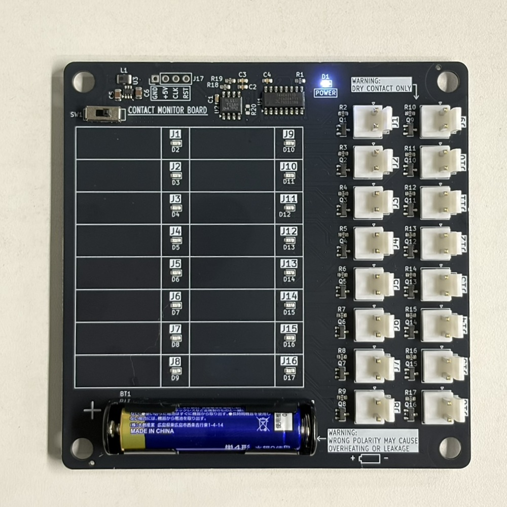
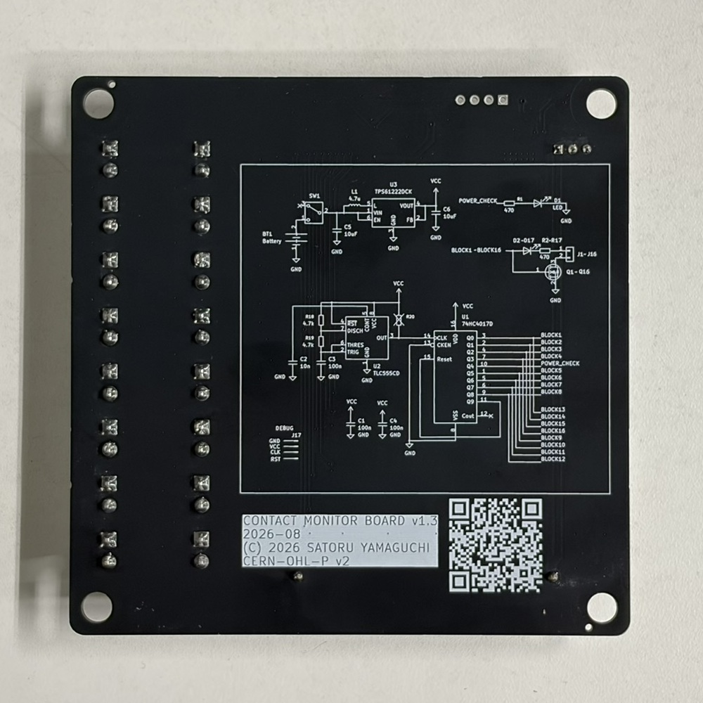

# Contact Monitor Board

16 チャンネルの無電圧接点（ドライコンタクト）モニタ基板です。
リミットスイッチ・押しボタン・リレー接点などの ON/OFF を、単 4 電池 1 本だけで 16 点同時に LED 表示します。

装置の配線チェックや、盤内の接点動作確認を電源レスで行うための道具として設計しています。

- 基板サイズ: 100 × 100 mm / 2 層
- 電源: 単 4 電池 × 1（1.5 V）→ 昇圧 5 V
- 設計環境: KiCad 9

回路図は [Contact-Monitor-Board.pdf](Contact-Monitor-Board.pdf) でも閲覧できます（KiCad は不要です）。

## 外観

| 表面 | 裏面 |
| --- | --- |
| [](Contact-Monitor-Board_photo_top.jpg) | [](Contact-Monitor-Board_photo_bot.jpg) |

表面は左上に電源部と観測用ヘッダ J17、下部に単 4 電池ホルダ（BT1）、右側に 2 列 × 8 の接点入力コネクタ（J1〜J16）を配置しています。各コネクタの脇に表示 LED があり、コネクタ番号と LED のリファレンスをシルク印字しています。写真は電源 ON の状態で、右上の電源表示 LED（D1）が点灯しています。中央の枠はチャンネル名を書き込めるラベル欄です。

裏面には回路図全体をシルクで印字しています。基板単体でも回路構成と J17 のピン配列を確認できます。

## 特徴

- **16 ch 一括表示** — 各チャンネルに 2 ピンコネクタと LED を 1 個ずつ。接点が閉じている ch の LED だけが点灯します。
- **電池 1 本で動作** — TPS61222 昇圧コンバータで単 4 電池 1 本から 5 V を生成。外部電源やアダプタは不要です。
- **ダイナミック点灯で低消費** — TLC555 + 74HC4017 でスキャンし、常時点灯するのは 16 ch 中 2 ch 分だけ。LED を全点灯させる方式に比べて平均電流を大きく下げています。
- **ch 間の回り込みなし** — 各チャンネルの帰り側に N-ch MOSFET を入れ、スキャンしていない ch を切り離しています。複数の接点が同時に閉じていても、他 ch を経由したゴースト点灯は起きません。
- **挿し間違えても偽陽性が出ない** — 本機のコネクタにハーネスをたすき掛けに挿してしまっても、LED と MOSFET を同じスキャン出力で駆動しているため点灯しません。接続ミスが「接点が閉じている」と誤表示されることがありません。
- **入手性重視の部品構成** — 全部品を JLCPCB / LCSC の在庫品で構成。抵抗は 470 Ω と 4.7 kΩ の 2 種類だけです。BOM・CPL・ガーバーを同梱しています。

## 動作原理

1 チャンネルの経路は次のとおりです。

```text
74HC4017 の出力 ──▶ LED ──▶ 470 Ω ──▶ Jn.1 ──[ 外部接点 ]──▶ Jn.2 ──▶ 2N7002(Qn) ──▶ GND
                                         （基板外の被測定接点）      ゲートは同じ出力で駆動
```

スキャン出力が H になると、その ch の LED 側と MOSFET 側が同時にアクティブになります。
外部接点が閉じていれば電流が流れて LED が点灯し、開いていれば経路が切れて消灯します。
出力が L の間はゲートも L なので MOSFET が OFF になり、その ch は完全に切り離されます。

スキャンの構成:

| ブロック | 内容 |
| --- | --- |
| クロック | TLC555 非安定発振（R18 4.7 k / R19 4.7 k / C3 100 nF、約 1 kHz） |
| スキャナ | 74HC4017 デコードカウンタ（Q9 を MR に接続した自己リセットで 9 ステップ） |
| ステップ割り当て | 8 ステップ × 2 ch = 16 ch、1 ステップは電源表示 LED（D1）。空きステップはありません |
| リフレッシュレート | 約 113 Hz（1 kHz ÷ 9 ステップ）— ちらつきは視認できません |

R20 は 4017 のクロック入力用プルアップとして基板パターン上に用意していますが、TLC555 の出力が CMOS プッシュプルのため不要です。**未実装（DNP）**とし、BOM・CPL からも除外しています。

LED 電流は各 ch の 470 Ω で制限しています。赤色 LED（Vf 2.0 V）で点灯時のピークが約 5 mA、デューティ 1/9 なので平均は約 0.6 mA です。
1 本の 4017 出力が 2 ch 分（LED 2 個 + MOSFET ゲート 2 個）を同時に駆動するため、ピーク時のピン電流は約 10 mA になります。
抵抗値をこれ以上下げる場合は、74HC4017 の出力電流（絶対最大定格 25 mA/ピン）が先に制約になる点に注意してください。

電源部は TPS61222（固定 5 V 出力）+ 4.7 µH インダクタの昇圧構成で、SW1（スライドスイッチ）が電池からの主電源スイッチです。

### 観測用ヘッダ J17

J17 はスキャン動作を確認するための 4 ピンヘッダ用ランドです（2.54 mm ピッチ）。基板上端、昇圧部（U3）と U2 の間にあり、各ピンの機能は基板表面にもシルク印字しています。1 番ピンは角ランドです。
R20 と同じく**未実装（DNP）**で、BOM・CPL からも除外しています。必要なときだけピンヘッダをはんだ付けして使ってください。

| ピン | シルク | 接続先 |
| --- | --- | --- |
| 1 | GND | GND |
| 2 | +5V | VCC（TPS61222 の 5 V 出力） |
| 3 | CLK | TLC555（U2）の出力 = 4017 のクロック入力 |
| 4 | RST | 4017 の Q9 出力 = MR（自己リセットのノード） |

CLK にオシロスコープを当てれば発振周波数を、RST を見ればスキャン 1 周（9 ステップ）の周期を確認できます。

> [!NOTE]
> CLK は U2 の出力に、RST は 4017 の Q9 出力に直結しています。どちらも CMOS プッシュプル出力なので、外部から信号を入力すると出力同士が衝突します。**観測専用の端子**として扱ってください。

## 接続間違い時の動作

本機の隣り合うコネクタで互い違いに接続しても、**その ch が点灯することはありません**。

各チャンネルは LED のアノードと MOSFET のゲートを**同じ 4017 出力**に接続しています。そのため電流が流れるのは、行き側（LED を通る経路）と帰り側（MOSFET を通る経路）が**同一ステップに属している場合だけ**です。

例として J1.1 を誤って J2.2 に接続した場合、次のようになります。

| タイミング | D2 のアノード | Q2 のゲート | 結果 |
| --- | --- | --- | --- |
| ステップ Q0（ch1） | H | L（Q2 は Q1 で駆動） | MOSFET が OFF、電流が流れない |
| ステップ Q1（ch2） | L（4017 が L に駆動） | H | アノードが GND 電位、電流が流れない |

どちらのタイミングでも点灯しないため、「閉じているはずの ch が点かない」という形で作業者が気づけます。

> [!NOTE]
> LED のアノードを VCC に直結する構成（部品点数を減らせる一般的な方式）にすると、ステップ Q1 のタイミングで D2 が点灯してしまい、正常な導通と区別がつかなくなります。アノードを 4017 出力に接続しているのはこのためで、意図的な設計です。

### 適用範囲

同一ステップを共有する 2 ch の間で入れ違えた場合だけは、原理上この保証が効きません。ペアは次のとおりです。

| 4017 出力 | 共有する ch |
| --- | --- |
| Q0 | ch1 / ch13 |
| Q1 | ch2 / ch14 |
| Q2 | ch3 / ch15 |
| Q3 | ch4 / ch16 |
| Q4 | 電源表示 D1（ch なし） |
| Q5 | ch5 / ch9 |
| Q6 | ch6 / ch10 |
| Q7 | ch7 / ch11 |
| Q8 | ch8 / ch12 |

コネクタは 2 列 × 8 の配置で、同一ステップのペアが基板上で約 43 mm 離れた対角位置になるよう割り当てています。

```text
   列 A（左）      列 B（右）
   J1  (Q0)       J9  (Q5)
   J2  (Q1)       J10 (Q6)
   J3  (Q2)       J11 (Q7)
   J4  (Q3)       J12 (Q8)
   J5  (Q5)       J13 (Q0)
   J6  (Q6)       J14 (Q1)
   J7  (Q7)       J15 (Q2)
   J8  (Q8)       J16 (Q3)
```

**物理的に隣接するコネクタの組み合わせは、縦・横・斜めのいずれもすべて異なるステップに属します。** したがって隣接コネクタへの挿し間違いは、全パターンが安全側に倒れます。

なお、これは「挿し間違いがあると点灯しない」という動作であり、接点が開いている場合・断線している場合と表示上は区別できません。いずれも点灯しない ch を調査すればよいため実用上の問題はありませんが、**挿し間違いが「導通あり」として点灯することはない**（偽陽性が出ない）というのが、この構成の保証する性質です。

## チャンネルと部品の対応

チャンネル *n* は次の組で構成されます（*n* = 1〜16）。

| 要素 | リファレンス |
| --- | --- |
| 接点入力コネクタ | J*n* |
| 表示 LED | D*(n+1)* |
| 電流制限抵抗 470 Ω | R*(n+1)* |
| スイッチング MOSFET | Q*n* |

D1 / R1 は電源表示用で、チャンネルには対応しません。

## 主要部品

| Ref | 部品 | 役割 | LCSC |
| --- | --- | --- | --- |
| U1 | 74HC4017D (SO-16) | デコードカウンタ（スキャナ） | C148206 |
| U2 | TLC555CD (SOIC-8) | スキャンクロック発振 | C6986 |
| U3 | TPS61222DCK (SC-70-6) | 昇圧 DC/DC（5 V 固定） | C116461 |
| L1 | 4.7 µH (1008) | 昇圧用インダクタ | C1329772 |
| Q1–Q16 | 2N7002 (SOT-23) | ch 切り離し用 N-ch MOSFET | C8545 |
| D2–D17 | LED (0603) | チャンネル表示 | C2286 |
| D1 | LED (0603) | 電源表示 | C2290 |
| R1–R17 | 470 Ω (0603) | LED 電流制限（R1 は電源表示用） | C23179 |
| R18, R19 | 4.7 kΩ (0603) | TLC555 発振用（R18 = Ra / R19 = Rb） | C23162 |
| J1–J16 | JST VH 相当 2 ピン（3.96 mm ピッチ・垂直） | 接点入力 | C160315 |
| SW1 | スライドスイッチ | 電源 ON/OFF | C5274456 |
| BT1 | BH-AAA-A1AJ001 | 単 4 電池ホルダ × 1 | C5290189 |

全リストは [jlcpcb/production_files/BOM-Contact-Monitor-Board.csv](jlcpcb/production_files/BOM-Contact-Monitor-Board.csv) を参照してください。

## 使い方

> [!WARNING]
> 電池は極性を確認してから入れてください。
> 本機に**逆接保護回路はありません**。
> 逆向きのまま SW1 を ON にすると、U3（TPS61222）の入力端子と L1 を通る経路で電池がほぼ短絡状態になり、電池の発熱と U3 の破損につながります。
> 電池の交換は SW1 を OFF にして行ってください。
> SW1 は電池の＋側直後にあるため、OFF であれば逆向きに入れても電流は流れません。

1. BT1 に単 4 電池を 1 本入れます。
2. SW1 を ON にすると、電源表示 LED（D1）が点灯します。
3. 調べたい接点を J1〜J16 のいずれかに接続します（極性はありません）。
4. 接点が閉じている ch の LED が点灯します。

> [!NOTE]
> 接点は**無電圧接点（ドライコンタクト）専用**です。
> 外部から電圧が加わっている端子には接続しないでください。

## ファイル構成

| パス | 内容 |
| --- | --- |
| `Contact-Monitor-Board.kicad_pro` | KiCad プロジェクトファイル |
| `Contact-Monitor-Board.kicad_sch` | 回路図 |
| `Contact-Monitor-Board.kicad_pcb` | 基板レイアウト |
| [Contact-Monitor-Board.pdf](Contact-Monitor-Board.pdf) | 回路図 PDF（KiCad 不要で閲覧可能） |
| [Library.pretty/](Library.pretty/) | プロジェクト固有フットプリント（電池ホルダ） |
| [jlcpcb/production_files/](jlcpcb/production_files/) | 製造用データ（ガーバー zip / BOM / CPL） |

## 製造

JLCPCB での発注を想定しています。

- 基板: 100 × 100 mm、2 層、標準厚 1.6 mm
- ガーバー: `jlcpcb/production_files/GERBER-Contact-Monitor-Board.zip`
- 実装（PCBA）を依頼する場合は、同ディレクトリの BOM / CPL をそのままアップロードできます。

## ライセンス

本プロジェクトのハードウェア設計（回路図・基板データ・フットプリント・製造データ）は
**CERN Open Hardware Licence Version 2 – Permissive (CERN-OHL-P v2)** で公開しています。

- SPDX 識別子: `CERN-OHL-P-2.0`
- ライセンス全文: [LICENSE](LICENSE)（原文: <https://ohwr.org/cern_ohl_p_v2.txt>）

このライセンスは、**いかなる保証もない**という条件のもとで、複製・改変・再頒布・商用利用を許諾するものです。
利用は自己責任でお願いします。
